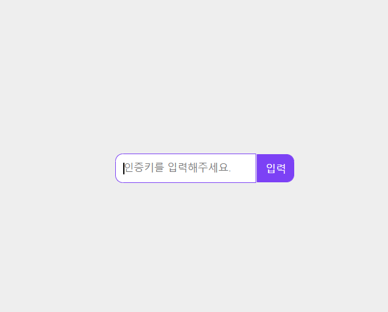
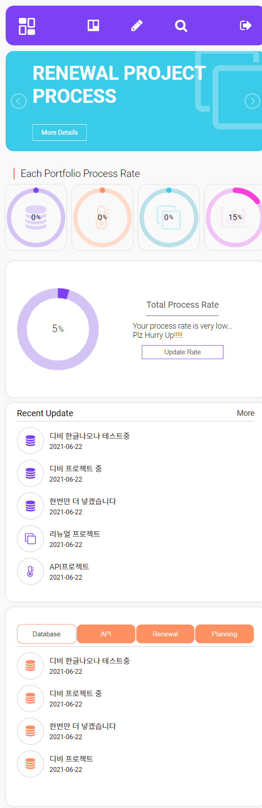

# Todo Project

---

> 프로젝트 진행 상황을 기록할 수 있는 웹 사이트
> 

DB에 암호화 되어있는 암호를 가져와 입력된 암호화 대조 후 index페이지로 이동

각 프로젝트의 진행 상황과 진행한 일정을 확인 가능

프로젝트의 진행 상황을 기록할 수 있음

진행된 일정을 볼 수 있음

반응형이 적용된 메인페이지

## Getting Started

- [Hosting Site](http://dkdn1004.dothome.co.kr/todo)
- Xampp 설치 후 로컬서버에 호스팅
    
    ### Prerequisites
    
    - PHP
    - Mysql
    - Bcrypt
